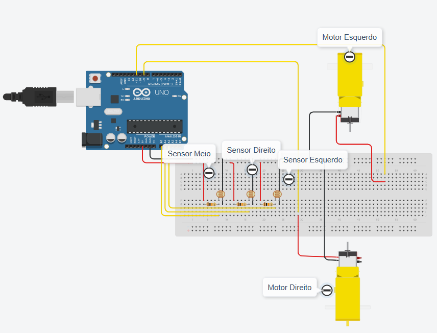
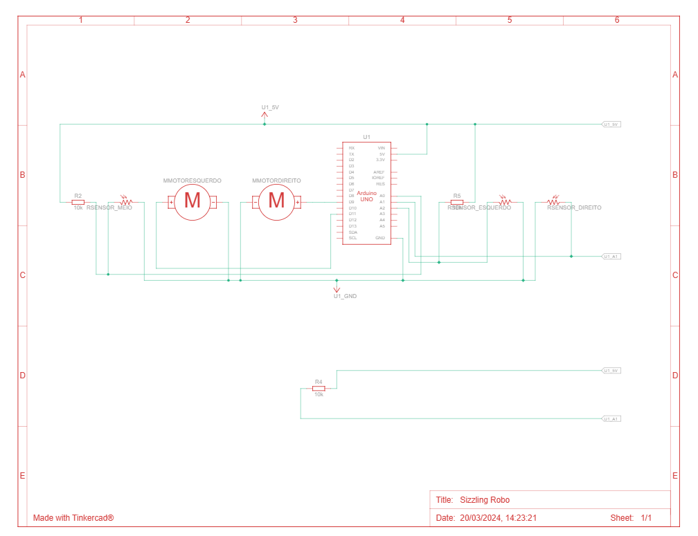

# Robo Seguidor de Linha - Arduino

Esse projeto foi realizado como proposta da matéria <em> Projeto Integrador Extensionista: Robótica Aplicada.</em>

Sistemas de Informação - Unimater

### Objetivo

O objetivo é montar um robo, utilizando sensores LDR, para que siga uma linha preta por um percurso. 

### Lógica

Esse projeto utiliza 3 sensores que serão dispostos a frete do carrinho. Considerando que a pista será um local plano, predominantemente branco, com uma linha preta como guia, seguimos a seguinte lógica:

- DIREÇÃO

    - Quando o sensor do meio estiver sobre a linha preta, os dois motores estarão ligados, fazendo com que o carrinho ande em linha reta.

    - Caso o sensor da direito passe sobre a linha preta, o motor da direita irá desligar e o motor da esquerda continuará ligado, fazendo com que o carrinho vire para direita corrigindo a posição.

    - Caso o sensor da esquerda passe sobre a linha preta, o motor da esquerda irá desligar e o motor da direita continuará ligado, fazendo com que o carrinho vire para esquerda corrigindo a posição.

    - Quando o carrinho corrigir a posição, os dois motores voltarão a ligar simultaneamente.

        Validação:
        ```c++
        if(sensorMeio > valorBase && sensorDireito < valorBase && sensorEsquerdo < valorBase || sensorMeio > valorBase && sensorDireito > valorBase && sensorEsquerdo > valorBase) {
            andarFrente();
        } else if(sensorDireito > valorBase && sensorEsquerdo < valorBase) {
            virarDireita();
        } else if(sensorEsquerdo > valorBase && sensorDireito < valorBase) {
            virarEsquerda();
        } else if(sensorMeio < valorBase && sensorDireito < valorBase && sensorEsquerdo < valorBase) {
            procurarLinha(); 
        } else {
            parar();
        }
        ```
        Funções:
        ```c++
        void andarFrente() {
            digitalWrite(motorDireito, HIGH);
            digitalWrite(motorEsquerdo, HIGH);
        }

        void virarDireita() {
            digitalWrite(motorDireito, LOW);
            digitalWrite(motorEsquerdo, HIGH);
        }

        void virarEsquerda() {
            digitalWrite(motorDireito, HIGH);
            digitalWrite(motorEsquerdo, LOW);
        }
        
        void procurarLinha() {
            digitalWrite(motorDireito, LOW);  
            digitalWrite(motorEsquerdo, LOW);
            delay(1500);
            digitalWrite(motorDireito, HIGH);  
            digitalWrite(motorEsquerdo, HIGH);
            delay(2000);
            digitalWrite(motorDireito, LOW);  
            digitalWrite(motorEsquerdo, HIGH);
            delay(3000);
        }
        ```

- VERIFICAÇAO DE CRUZAMENTO

    - Em casos que tenha 2 linhas em sentidos opostos formando um "+", os 3 sensores estarão com a identificação da linha preta, nesse caso, ele manterá os 2 motores ligados fazendo com que o carrinho permaneça em movimento reto.

- PERDA DA LINHA DO PERCURSO
    - Caso ocorra do carrinho perder a linha preta, ou seja, os 3 sensores não lerem mais a linha, a seguinte lógica foi aplicada:
        
        - O robo desligará os 2 motores sinalizando que perdeu a leitura da linha durante 1,5 segundos.
        - Ligará novamente os 2 motores por 2 segundos.
        - Desligará o motor direito por 3 segundo, fazendo o robo alterar sua rota na tentativa de localizar novamente a linha.
        - Esse processo se repetirá enquanto a linha não for localizada.

#

### Equipe

* [Mateus Vinicius Stangherlin](https://www.linkedin.com/in/mateus-stangherlin-47a1b1230/)

* André Vinicius

* Samuel Matsuo


### Lista de Componentes

| Nome  | Quantidade | Componente |
| ------------- | ------------- | ------------- |
| U1  | 1  | Arduino Uno R3 |
| Motor Direito/Esquerdo  | 2 | Motor de engrenagem de uso não profissional |
| Sensor Meio/Direito/Esquerdo  | 3  | Fotorresistor |
| R1/R2/R3  | 3  | 10 kΩ Resistor |
 

### Vista do Circuito



### Esquemática

